# FEEDS.
### Github Action for building static feed aggregator site

A GitHub Action that fetches RSS/Atom feeds from an OPML file and builds a static site aggregating all the feed content. This project creates a modern, responsive feed reader as a static site.

An example repository is provided in the example/ directory. 

---

Original Project: Based on llun/feeds@3.0.0. Updated documentation and provided cartography as I found the existing repo lacking in documentation. 

New entry added to Context 7 with complete Cartography and diagrams included in order to illustrate process flow in the backend. 

The repos used to create this Cartography may be a newer version than this. This Repo is not maintained. Please see the original repo linked below. 

https://github.com/llun/feeds
https://github.com/llunbot/personal-feeds

---

## Usage

To use it, create a new repository and add an OPML file named `feeds.opml` with your list of website RSS/Atom feeds. Create a GitHub workflow like the one below to fetch data and store it in a contents branch:

```
name: Schedule

on:
  schedule:
    - cron: '0 * * * *'

jobs:
  playground:
    runs-on: ubuntu-latest
    name: Test
    steps:
      - name: Run Action
        uses: llun/feeds@3.0.0
```

After this, enable GitHub Pages on the `contents` branch and the content will be available on that page.

## Configurations

This action can be configured to use a custom domain and different types of storage. Here are the available configuration options:

- `customDomain`: Specifies the custom domain for the feeds site. Required when generating a static site as it's needed to generate the `CNAME` file.
- `branch`: Branch where the static site will be generated. The default value is `contents`. This is the branch you'll need to point the repository's GitHub Pages to.
- `storageType`: **(Default is `files`)** Content storage type, currently supports `files` and `sqlite`. 
  - `files`: Stores all feed contents in a JSON tree structure
  - `sqlite`: Stores content in a SQLite database that the client will download using HTTP chunks
- `opmlFile`: Name of the OPML file containing the list of sites you want to include in your feed site.

### Sample Configuration

```
name: Schedule

on:
  schedule:
    - cron: '0 * * * *'

jobs:
  playground:
    runs-on: ubuntu-latest
    name: Generate Feeds
    steps:
      - name: Run Action
        uses: llun/feeds@3.0.0
        with:
          storageType: files
          opmlFile: site.opml
          branch: public
```

## The action grabs RSS/Atom content 
and stores it, for both storage modes. 

Here's where the feed content is fetched and parsed
```
- Grab happens in action/feeds/opml.ts → loadFeed(title, url)
  - Performs fetch(url, { headers: { 'User-Agent': 'llun/feed' } })
  - Reads text, then parseXML (xml2js)
  - Branches:
    - RSS: action/feeds/parsers.ts → parseRss(feedTitle, xml)
      - Uses item['content:encoded'] or description as content
    - Atom: action/feeds/parsers.ts → parseAtom(feedTitle, xml)
      - Uses entry.content (._) or entry.summary (._) as content
  - sanitize-html is applied in both paths so content in entries is sanitized (default allowed tags + img)
```
Where the parsed content is stored

```
SQLite path (storageType: 'sqlite')
- Triggered by index.ts → createFeedDatabase(getGithubActionPath())
  - action/feeds/index.ts → createFeedDatabase(githubActionPath)
    - Reads OPML from $GITHUB_WORKSPACE/opmlFile → readOpml
    - copyExistingDatabase(publicPath) optionally seeds prior DB
    - getDatabase(publicPath) opens/creates public/data.sqlite3
    - createTables(knex) ensures schema
    - createOrUpdateDatabase(db, opml, loadFeed) iterates OPML items:
      - Calls loadFeed for each site (grabs content as above)
      - insertCategory(db, category)
      - insertSite(db, category, site)
      - For each entry in site.entries:
        - insertEntry(db, siteKey, siteTitle, category, entry)
          - Writes sanitized HTML to Entries.content
          - Also writes linking rows to EntryCategories
      - Cleans up removed categories/sites/entries
- Artifact location: public/data.sqlite3 (under the Action path), served to the frontend when NEXT_PUBLIC_STORAGE=sqlite
```

```
Files/JSON path (storageType: anything except 'sqlite', e.g., 'files')
- Triggered by index.ts → createFeedFiles(getGithubActionPath())
  - action/feeds/index.ts → createFeedFiles(githubActionPath)
    - loadOPMLAndWriteFiles(publicPath, opmlPath) in action/feeds/file.ts:
      - Reads OPML → readOpml
      - For each item: calls loadFeed (grabs content as above)
      - Writes one snapshot per site: contents/{Category}/{siteHash}.json
        - Includes sanitized HTML for each entry under site.entries[].content
    - Then prepares derived datasets used by the UI:
      - prepareDirectories(DEFAULT_PATHS)
      - createRepositoryData(...)
      - createCategoryData(DEFAULT_PATHS)
        - Calls createSitesData(...) which also calls createEntryData(...)
          - Writes per-site: public/data/sites/{siteHash}.json
          - Writes per-entry: public/data/entries/{entryHash}.json (content, link, timestamps, etc.)
      - createAllEntriesData() aggregates to public/data/all.json
- Artifact locations:
  - Raw feed snapshots: contents/{Category}/{siteHash}.json
  - UI datasets: public/data/categories.json, public/data/categories/{category}.json, public/data/sites/{siteHash}.json, public/data/entries/{entryHash}.json, public/data/all.json
  ```

### Minimal call-chain summary
```
- Fetch + parse + sanitize: action/feeds/opml.ts: loadFeed → parsers.ts: parseRss/parseAtom → sanitize-html
- Store (SQLite): action/feeds/database.ts: insertSite, insertEntry → public/data.sqlite3
- Store (Files/JSON): action/feeds/file.ts: loadOPMLAndWriteFiles → contents/... and then create*Data → public/data/...
```

---

# Data Flow Overview
# FeedsFetcher Cartography: Data Flows and Intersections (Comprehensive)

This section contains the full set of Mermaid diagrams mapping the backend behavior when implemented as a GitHub Action, plus per-directory cartography. Diagrams emphasize intersections where files collaborate in workflows.

### Note on storageType:
- action.yml defaults to "database"
- createFeedDatabase() checks for "sqlite"
- createFeedFiles() runs when storageType !== 'sqlite'
- buildSite() sets NEXT_PUBLIC_STORAGE=files only when storageType == 'files'
```
Treat this when configuring workflows.

---

## 1) End-to-end GitHub Action Lifecycle

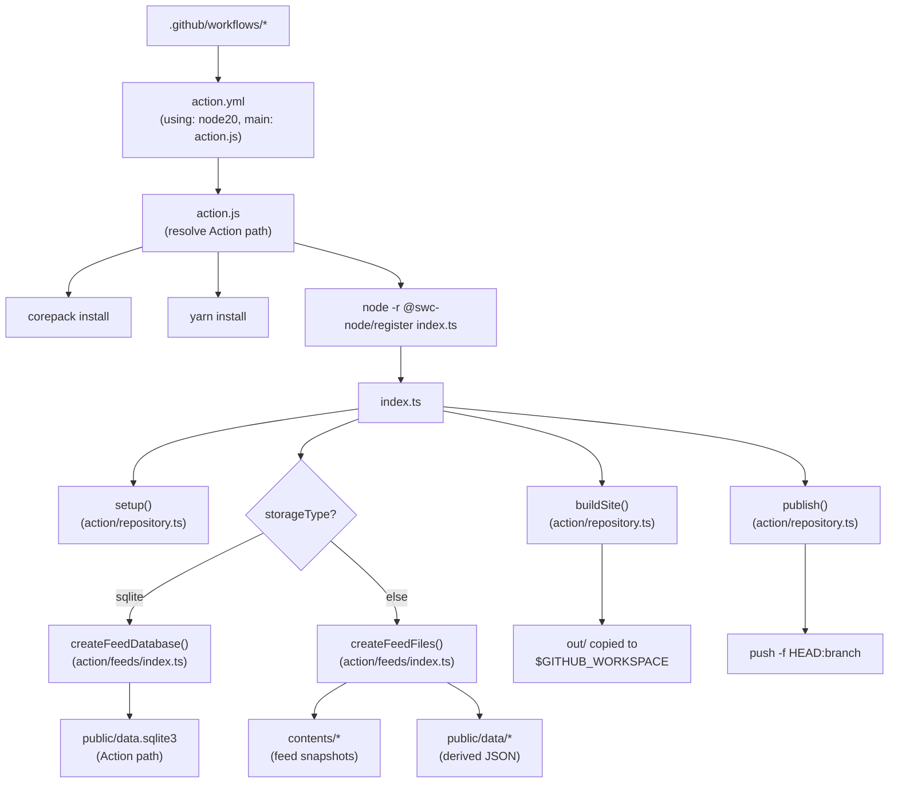

---

## 2) Repository Operations (setup, build, publish)

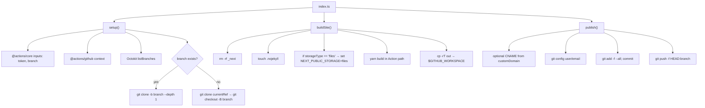

---

## 3) SQLite Database Pipeline

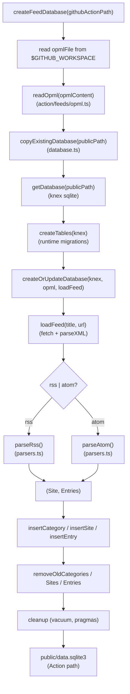

---

## 4) Files/JSON Pipeline

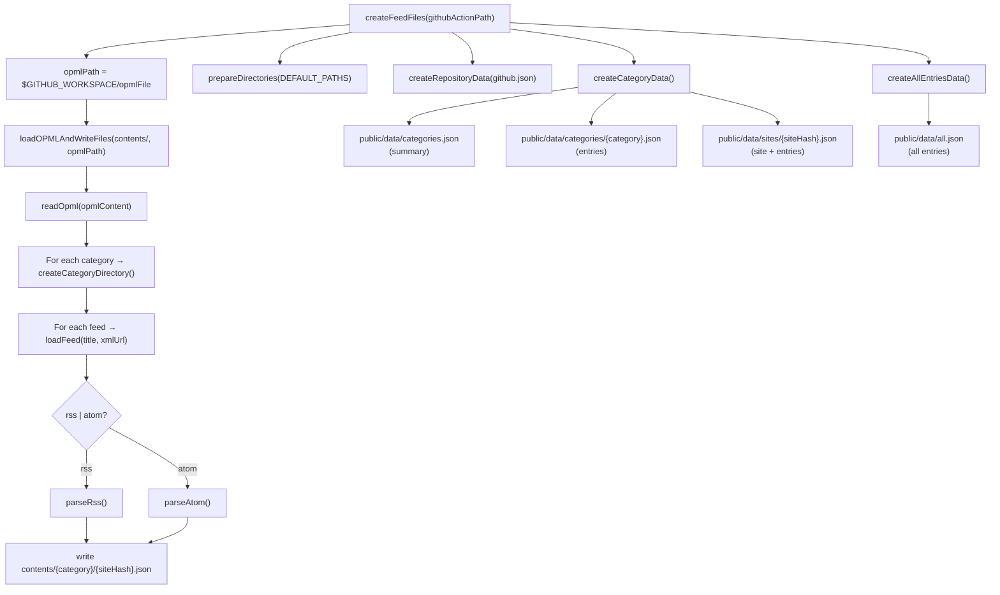

---

## 5) Frontend Runtime Data Access (Next.js)

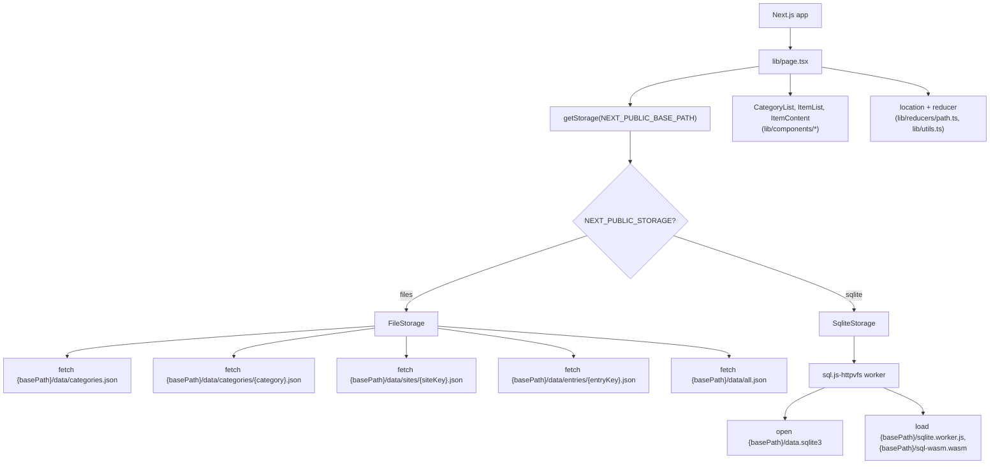

---

## 6) Data Model Overview (SQLite)

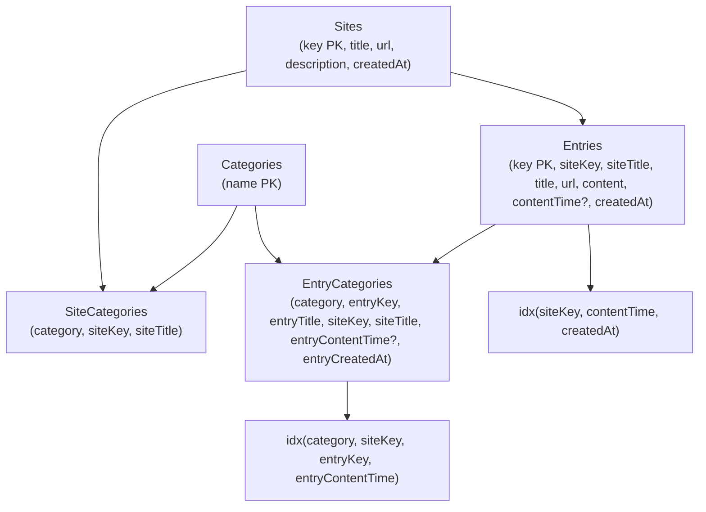

### JSON artifacts correspondence:

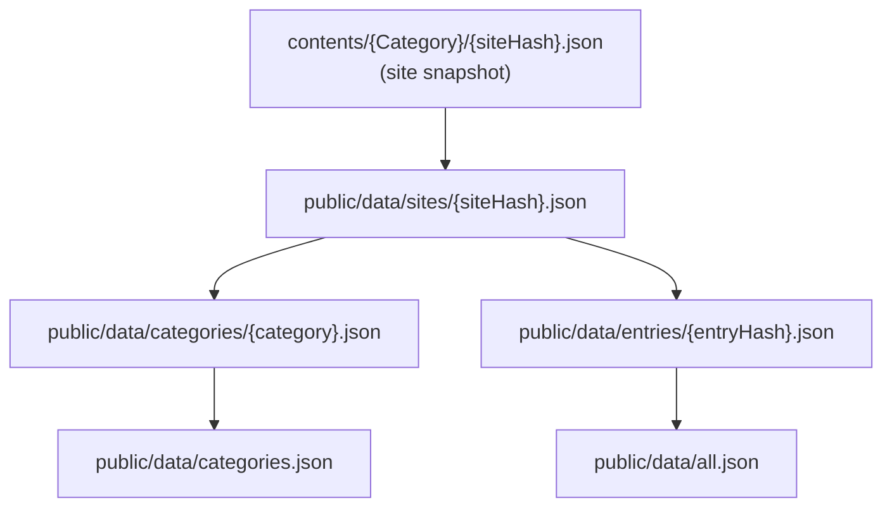

---

## 7) Per-directory Cartography (files and intersections)

### action/ and root:

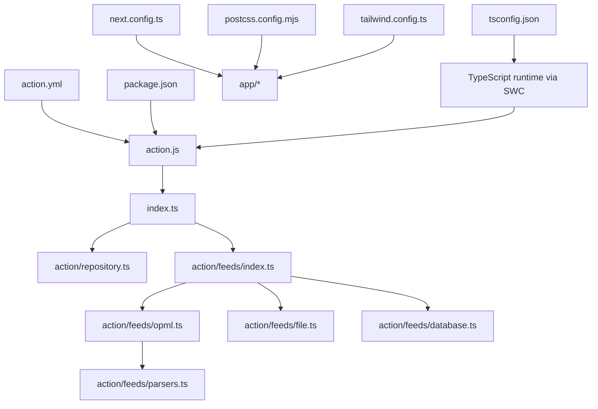

### app/ and lib/:

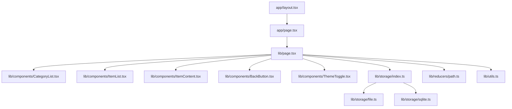

lib/storage/ runtime assets:

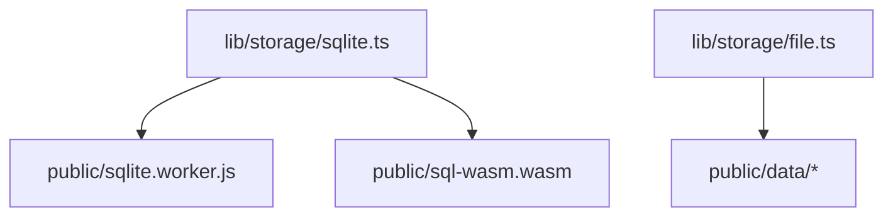

### example/:

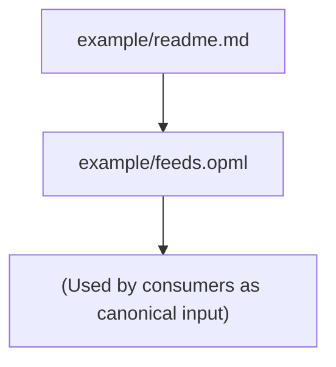

### public/:

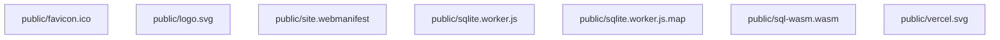

### tests and fixtures:

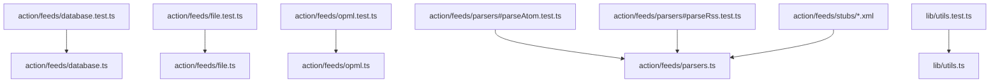

---

## 8) Intersection Flowcharts (process specifics)

index.ts orchestration:

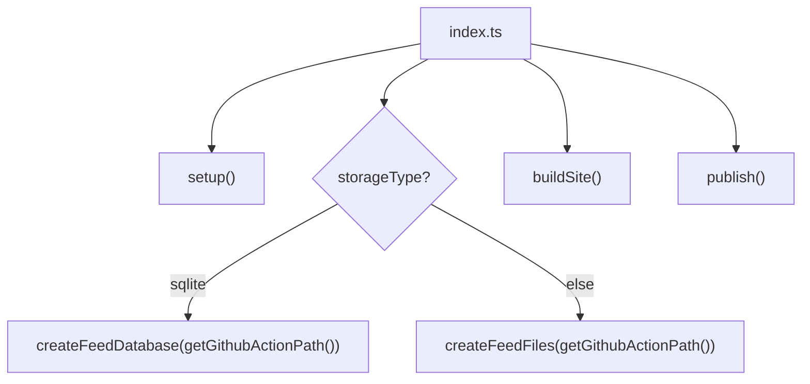

### feeds/index.ts dispatch:

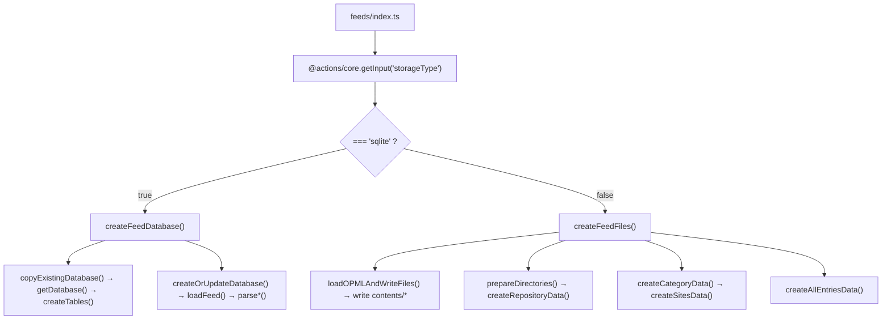

### publish cleanup list (files removed prior to publish):

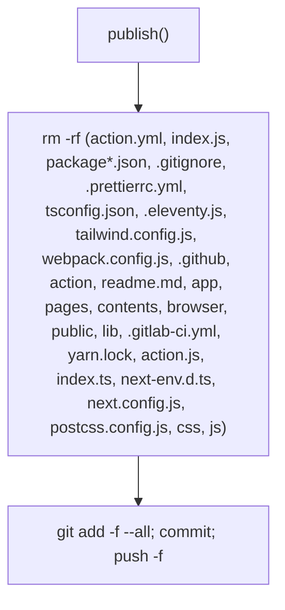

---

## 9) Canonical Workflow (illustrative)

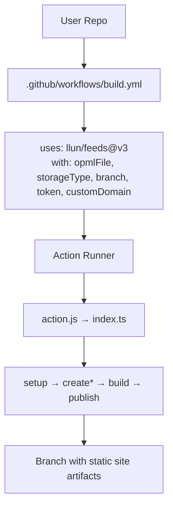

---

## 10) File Inventory Covered (nodes appear in graphs above)

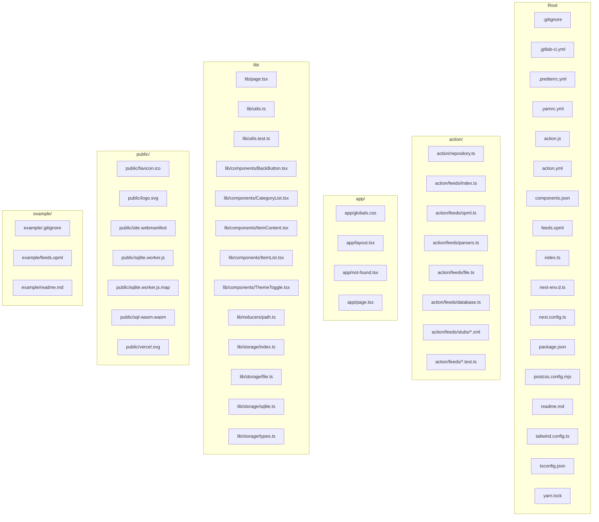

# Cartographic Report of the Action

# Cartography Report: FeedsFetcher (Comprehensive, Backend-Focused with GitHub Actions)

This report replaces the previous cartography and provides a comprehensive, backend-focused mapping of how this repository behaves when run as a GitHub Action. It also enumerates all files and draws intersection flowcharts (Mermaid) wherever workflows cross module boundaries. The example folder is treated as the canonical usage source.

Contents:
- 1. Executive Summary
- 2. GitHub Action Lifecycle (end-to-end)
- 3. Inputs, Environment, and Artifacts
- 4. Backend Pipelines
  - 4.1 SQLite database pipeline
  - 4.2 Files/JSON pipeline
- 5. Site Build and Publish (repository operations)
- 6. Next.js Runtime Data Access
- 7. Database Model and Data Artifacts
- 8. Canonical Example Usage
- 9. Error Surfaces and Defensive Behavior
- 10. Per-file Cartography and Directory Graphs (all files)
- Appendix: Large dependency overview graphs (per directory)

---

## 1. Executive Summary

FeedsFetcher aggregates feeds defined in an OPML file into either:
- a client-consumable SQLite database (public/data.sqlite3 + web worker), or
- static JSON datasets under public/data and feed snapshots under contents/.

It runs as a composite Node20 GitHub Action that, when invoked in a GitHub Actions workflow:
1) boots via action.js inside the hosted runner’s Action path,  
2) installs dependencies and executes index.ts with SWC runtime register,  
3) clones your repository’s workspace, checks out/pivots branches,  
4) reads the OPML and pulls/parses feeds, materializes data (SQLite or JSON),  
5) builds a Next.js static site in the Action’s working dir, then copies artifacts to the workspace,  
6) publishes the workspace to the configured branch (force-pushed).

Top-level runtime toggles are controlled by inputs in action.yml (opmlFile, storageType, branch, token, customDomain).

---

## 2. GitHub Action Lifecycle (end-to-end)

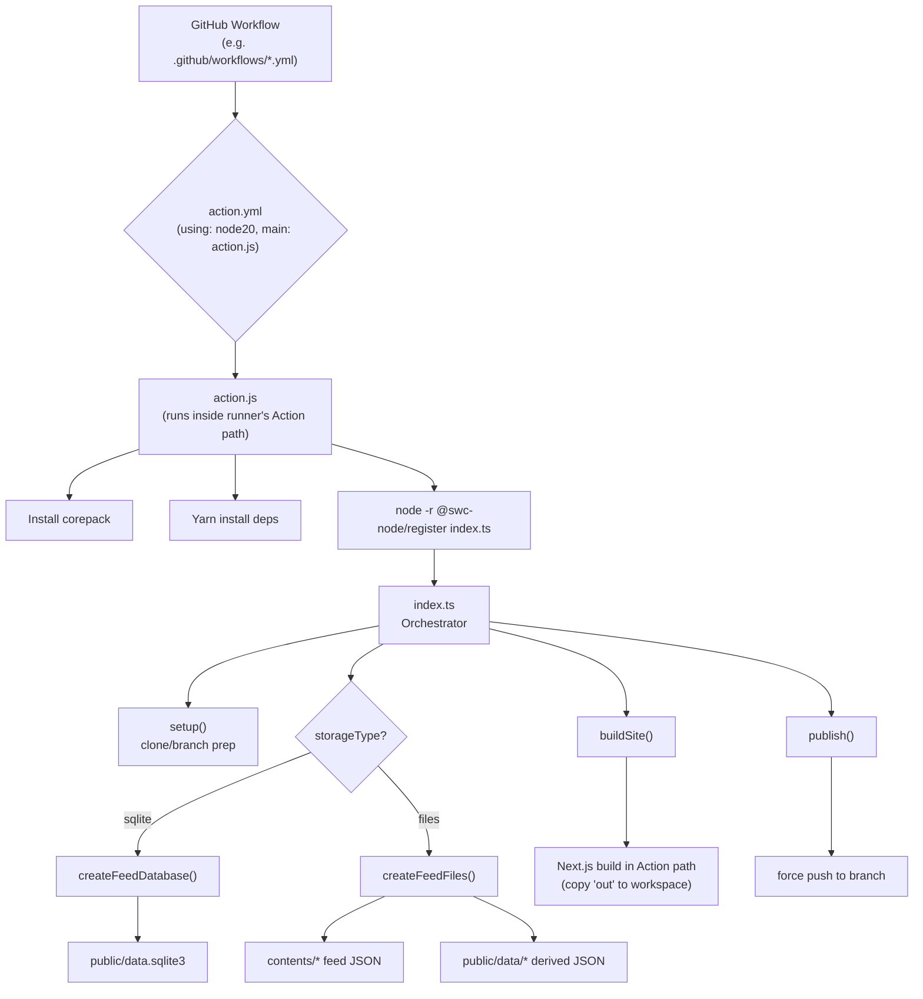

Key intersections:
- action.js bootstraps Node and SWC to run TypeScript without transpilation.
- index.ts calls repository.ts functions (setup/buildSite/publish) and feeds/index.ts functions (createFeedDatabase/createFeedFiles).
- feeds/index.ts dispatches into database.ts or file.ts paths and uses opml.ts and parsers.ts.

---

## 3. Inputs, Environment, and Artifacts

From action.yml:
- opmlFile: OPML file path in repo (default feeds.opml)
- storageType: "database" or "files" (action/feeds/index.ts maps "sqlite" vs else; see note)
- branch: output branch for published static site (default contents)
- token: GitHub token for repo cloning/push (default ${{ github.token }})
- customDomain: custom CNAME content (optional)

Runtime environment:
- GITHUB_WORKSPACE: workspace target for clone/build copy/publish
- GITHUB_ACTION: used in action.js to guard execution
- Action Path detection: /home/runner/work/_actions/llun/feeds/(version|main)

Artifacts:
- When storageType == sqlite: public/data.sqlite3 (in Action path), sql worker files public/sqlite.worker.js, public/sql-wasm.wasm
- When storageType != sqlite: contents/{Category}/{site-hash}.json plus public/data/categories.json, public/data/categories/*.json, public/data/sites/*.json, public/data/entries/*.json, public/data/all.json
- Built site: copied from Action’s out/ to workspace root
- Publish: force push HEAD to configured branch on origin

---

## 4. Backend Pipelines

### 4.1 SQLite database pipeline

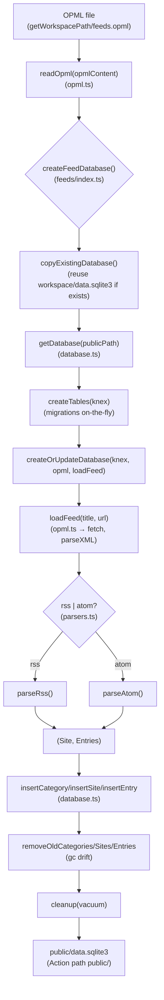

Notes:
- publicPath is computed from index.ts’s getGithubActionPath() for Action-local public directory.
- copyExistingDatabase allows incremental updates if a prior data.sqlite3 exists in the workspace root.

### 4.2 Files/JSON pipeline

```mermaid
graph TD
    A["OPML path<br/>(getWorkspacePath + opmlFile)"] --> B{"createFeedFiles()<br/>(feeds/index.ts)"}
    B --> C["loadOPMLAndWriteFiles(publicPath, opmlPath)<br/>(file.ts)"]
    C --> D["readOpml(opmlContent)"]
    D --> E["For each category → ensure directory<br/>createCategoryDirectory()"]
    E --> F["For each feed → loadFeed(title, xmlUrl)"]
    F --> G{"rss | atom?<br/>(parsers.ts)"}
    G -->|rss| H["parseRss()"]
    G -->|atom| I["parseAtom()"]
    H --> J["Write contents/{category}/{siteHash}.json"]
    I --> J["Write contents/{category}/{siteHash}.json"]

    %% Derived data
    B --> K["prepareDirectories(DEFAULT_PATHS)"]
    B --> L["createRepositoryData(..., GITHUB_REPOSITORY, customDomain)"]
    B --> M["createCategoryData(DEFAULT_PATHS)"]
    M --> N["createSitesData(...)<br/>reads contents/* → writes sites/*.json"]
    M --> O["Write public/data/categories.json"]
    M --> P["Write public/data/categories/{category}.json"]
    B --> Q["createAllEntriesData()<br/>reads entries/*.json → write all.json"]
```

DEFAULT_PATHS uses getGithubActionPath() to place files under the Action path (public/data and contents). The Next.js build step will copy final out/ to the workspace; publish subsequently pushes the workspace.

---

## 5. Site Build and Publish (repository operations)

```mermaid
graph TD
    A["index.ts"] --> B["setup()<br/>(repository.ts)"]
    B --> B1["get inputs: token, branch, actor"]
    B --> B2["listBranches via Octokit"]
    B2 --> B3{"branch exists?"}
    B3 -->|yes| B4["git clone -b branch --depth 1<br/>into GITHUB_WORKSPACE"]
    B3 -->|no| B5["git clone -b currentRef --depth 1 → checkout -B branch"]
    A --> C["buildSite()"]
    C --> C1["rm -rf _next; touch .nojekyll"]
    C --> C2["if storageType=='files' set NEXT_PUBLIC_STORAGE=files"]
    C --> C3["yarn build in Action path"]
    C --> C4["cp -rT out → GITHUB_WORKSPACE"]
    A --> D["publish()"]
    D --> D1["optional CNAME from customDomain"]
    D --> D2["git config user/email"]
    D --> D3["git add -f --all; commit; push -f HEAD:branch"]
```

Sensitive operations:
- Cloning with embedded token in URL
- Force push publishes static artifacts branch

---

## 6. Next.js Runtime Data Access

```mermaid
graph TD
    A["Next.js app"] --> B["lib/page.tsx Page"]
    B --> C["getStorage(NEXT_PUBLIC_BASE_PATH)"]
    C --> D{"NEXT_PUBLIC_STORAGE?"}
    D -->|files| E["FileStorage(basePath)<br/>(lib/storage/file.ts)"]
    D -->|sqlite| F["SqliteStorage(basePath)<br/>(lib/storage/sqlite.ts)"]
    E --> E1["fetch basePath/data/*.json"]
    F --> F1["sql.js-httpvfs worker<br/>load data.sqlite3 + worker/wasm"]
    B --> G["CategoryList, ItemList, ItemContent<br/>(lib/components/*)"]
    G --> H["User navigation updates reducer<br/>(lib/reducers/path.ts)"]
```

- When buildSite runs with storageType==files, it sets NEXT_PUBLIC_STORAGE=files so the frontend uses JSON datasets. Without that, default in getStorage() falls to FileStorage unless explicitly set to ‘sqlite’ in env. To serve SQLite, the deployment must set NEXT_PUBLIC_STORAGE=sqlite and ensure public/sqlite.worker.js and sql-wasm.wasm are served with data.sqlite3.

---

## 7. Database Model and Data Artifacts

Relational entities (database.ts creates tables dynamically):
- SchemaVersions (versioning)
- Categories (name primary key)
- Sites (key=sha256(title), title, url, description, createdAt)
- SiteCategories (category, siteKey, siteTitle) with FKs and indices
- Entries (key=sha256(title+link), siteKey, siteTitle, title, url, content, contentTime?, createdAt) with composite index
- EntryCategories (category, entryKey, entryTitle, siteKey, siteTitle, entryContentTime?, entryCreatedAt) with indices and FKs

Files/JSON artifacts:
- contents/{Category}/{siteHash}.json snapshots of source feeds
- public/data/github.json repository metadata (createRepositoryData)
- public/data/categories.json (summary of categories)
- public/data/categories/{category}.json (category entries list)
- public/data/sites/{siteHash}.json (site detail + entries)
- public/data/entries/{entryHash}.json (entry detail)
- public/data/all.json (flat all entries list, sorted desc by date)

---

## 8. Canonical Example Usage

The example/ folder is an empty repo with a populated example/feeds.opml. In a consumer repository:
- Place feeds.opml at repo root or point opmlFile to location.
- Configure workflow to run this Action; choose storageType:
  - database/sqlite pipeline produces a single data.sqlite3 for the client
  - files pipeline produces contents/* + public/data/* JSON.

Minimal workflow concept (illustrative):
```yaml
name: Build Feeds
on:
  push:
  schedule:
    - cron: "0 * * * *"
jobs:
  build:
    runs-on: ubuntu-latest
    steps:
      - name: FeedsFetcher
        uses: llun/feeds@v3
        with:
          opmlFile: feeds.opml
          storageType: database   # or files
          branch: contents
          token: ${{ secrets.GITHUB_TOKEN }}
          customDomain: ''
```

---

## 9. Error Surfaces and Defensive Behavior

- action.js: throws on corepack install failure, yarn install failure, or index.ts launch failure.
- repository.setup(): throws on failed git clone or branch switch.
- repository.buildSite(): throws on Next.js build failure; always copies out to workspace after build attempt.
- feeds/opml.ts.loadFeed(): catches network/XML errors and returns null; logs feed failure but continues pipeline.
- database.ts: defensive checks when inserting, transactional site/category linkage, vacuum and pragmas in cleanup.
- file.ts: stat/mkdir recursion for directories; continues on per-feed errors; JSON write boundaries per site.

Operational considerations:
- Force push overwrites target branch.
- copyExistingDatabase uses COPYFILE_EXCL to not overwrite target if already present; logs and continues on errors.

---

## 10. Per-file Cartography and Directory Graphs (all files)

The following table enumerates every file in the repository and its role. Where a file is part of a workflow intersecting other files, we add a process note.

- .gitignore — workspace hygiene, ensures public artifacts don’t pollute repo during action run.
- .gitlab-ci.yml — alternate CI; not used by GitHub Action runtime.
- .prettierrc.yml — formatting.
- .yarnrc.yml — Yarn v4 config for action runtime.
- action.js — Node bootstrap inside runner Action path; installs deps; launches index.ts with SWC.
- action.yml — Action metadata and inputs; using node20; main is action.js.
- components.json — Shadcn configuration (Used by UI build).
- feeds.opml — Repo-local OPML source (used when running locally via scripts).
- index.ts — Orchestrator: setup -> createFeedDatabase/createFeedFiles -> buildSite -> publish.
- next-env.d.ts — Next.js types.
- next.config.ts — Next.js config.
- package.json — Scripts, dependencies (SWC, Actions libs, Next.js), Yarn resolution.
- postcss.config.mjs — Tailwind/PostCSS.
- readme.md — Project readme.
- tailwind.config.ts — Tailwind.
- tsconfig.json — TypeScript config.
- yarn.lock — lockfile for Yarn.

Directory: action/
- action/repository.ts — Git operations, Action path detection, workspace path, build & publish.
- action/repository.ts intersects with:
  - index.ts (caller)
  - GitHub runner environment (GITHUB_WORKSPACE, GITHUB_ACTION, GITHUB_REPOSITORY)
  - Octokit and @actions/core/github
  - Next.js build step (yarn build) and copying build artifacts to workspace

Directory: action/feeds/
- action/feeds/index.ts — Dispatches storage mode:
  - createFeedDatabase(path) for sqlite
  - createFeedFiles(path) for files/JSON
  - Intersections: @actions/core, getWorkspacePath(), file.ts, database.ts, opml.ts
- action/feeds/opml.ts — loadFeed() (fetch, parseXML, parseAtom/parseRss), readOpml().
  - Intersections: parsers.ts
- action/feeds/parsers.ts — XML parsing, sanitization, normalization to Site/Entry.
- action/feeds/database.ts — Knex/SQLite schema and write/read helpers; GC of categories/sites/entries; incremental copy-in from workspace DB.
- action/feeds/file.ts — Writes contents/* per site snapshot and derives public/data/* datasets for UI.

Directory: app/
- app/globals.css — Global CSS.
- app/layout.tsx — Next.js RootLayout.
- app/not-found.tsx — 404 page.
- app/page.tsx — Next.js entry, likely wraps lib/page.tsx or composes with lib components.

Directory: cartography/
- cartography/report.md — This file.
- cartography/data-flow.md — Flowcharts (expanded in companion doc).

Directory: example/
- example/.gitignore — example repo hygiene.
- example/feeds.opml — Canonical OPML for demonstration.
- example/readme.md — Canonical usage note.

Directory: lib/
- lib/page.tsx — Client Page component orchestrating UI: fetches categories, renders lists/content, uses reducer.
- lib/utils.ts + lib/utils.test.ts — Utilities for routing state and UI classnames.
- lib/components/*.tsx — UI components:
  - BackButton.tsx
  - CategoryList.tsx
  - ItemContent.tsx
  - ItemList.tsx
  - ThemeToggle.tsx
- lib/reducers/path.ts — Reducer for path/location state.
- lib/storage/types.ts — Types for Storage interface (Category, Content, SiteEntry).
- lib/storage/index.ts — getStorage() switch on NEXT_PUBLIC_STORAGE to `files` or `sqlite`.
- lib/storage/file.ts — Fetch JSON assets under basePath/data/*.json.
- lib/storage/sqlite.ts — Load SQL DB with sql.js-httpvfs worker and query via SQL.
- lib/fixtures/ — Any fixtures (not currently listed with files here).

Directory: public/
- public/favicon.ico, logo.svg, vercel.svg — assets.
- public/site.webmanifest — PWA metadata.
- public/sqlite.worker.js, public/sqlite.worker.js.map — sql.js-httpvfs worker script.
- public/sql-wasm.wasm — sql.js runtime wasm.

Process intersections worth flowcharting:
- index.ts ↔ repository.ts (setup/build/publish)
- index.ts ↔ feeds/index.ts (storage path)
- feeds/index.ts ↔ opml.ts + parsers.ts (feed loading/parsing)
- feeds/index.ts ↔ database.ts (SQLite pipeline)
- feeds/index.ts ↔ file.ts (Files/JSON pipeline)
- buildSite (sets env for UI) ↔ lib/storage/* (runtime selection of storage)
- publish ↔ workspace (copy out/ then push to branch)

---

## Appendix A: Dependency Overview Graphs

High-level modules:

```mermaid
graph TD
    A["action.yml"] --> B["action.js"]
    B --> C["index.ts"]
    C --> D["action/repository.ts"]
    C --> E["action/feeds/index.ts"]
    E --> F["action/feeds/opml.ts"]
    E --> G["action/feeds/file.ts"]
    E --> H["action/feeds/database.ts"]
    F --> I["action/feeds/parsers.ts"]

    %% Frontend
    J["next.config.ts"] --> K["app/*"]
    K --> L["lib/page.tsx"]
    L --> M["lib/components/*"]
    L --> N["lib/storage/index.ts"]
    N --> O["lib/storage/file.ts"]
    N --> P["lib/storage/sqlite.ts"]
    P --> Q["public/sqlite.worker.js, sql-wasm.wasm"]
    O --> R["public/data/*.json"]
    H --> S["public/data.sqlite3"]
    G --> T["contents/* + public/data/*"]
```

Repository operations only:

```mermaid
graph TD
    A["index.ts"] --> B["setup()"]
    B --> C["Octokit listBranches"]
    B --> D["git clone checkoutBranch"]
    D --> E{"branch exists?"}
    E -->|no| F["git checkout -B branch"]
    A --> G["buildSite()"]
    G --> H["yarn build in Action path"]
    H --> I["cp -rT out → $GITHUB_WORKSPACE"]
    A --> J["publish()"]
    J --> K["git add/commit/push -f HEAD:branch"]
```

SQLite pipeline only:

```mermaid
graph TD
    A["readOpml()"] --> B["createOrUpdateDatabase()"]
    B --> C["removeOldCategories/Sites/Entries"]
    B --> D["for each feed → loadFeed()"]
    D --> E["parseRss/parseAtom → Site/Entries"]
    E --> F["insertCategory/insertSite/insertEntry"]
    F --> G["cleanup(vacuum)"]
```

Files pipeline only:

```mermaid
graph TD
    A["readOpml()"] --> B["createCategoryDirectory()"]
    B --> C["for each feed → loadFeed()"]
    C --> D["parseRss/parseAtom"]
    D --> E["write contents/{category}/{siteHash}.json"]
    E --> F["prepareDirectories(DEFAULT_PATHS)"]
    F --> G["createSitesData() → public/data/sites/*.json"]
    G --> H["createCategoryData() → categories.json & /categories/*.json"]
    G --> I["createAllEntriesData() → all.json"]
```

Frontend runtime selection:

```mermaid
graph TD
    A["buildSite sets NEXT_PUBLIC_STORAGE=files?<br/>(repository.buildSite)"] --> B["getStorage()"]
    B -->|files| C["FileStorage → fetch public/data/*.json"]
    B -->|sqlite| D["SqliteStorage → sql.js worker → public/data.sqlite3"]
```

---

This report pairs with the expanded flowcharts in cartography/data-flow.md for visual deep dives. It accounts for every file in the repo and highlights all major workflow intersections relevant to GitHub Actions execution.

## Sample Sites
- https://feeds.llun.dev
- https://llun.github.io/feeds/

## Sample Repository

- https://github.com/llunbot/personal-feeds