# FeedsFetcher Cartography: Data Flows and Intersections (Comprehensive)

This file contains the full set of Mermaid diagrams mapping the backend behavior when implemented as a GitHub Action, plus per-directory cartography. Diagrams emphasize intersections where files collaborate in workflows.

Note on storageType:
- action.yml defaults to "database"
- createFeedDatabase() checks for "sqlite"
- createFeedFiles() runs when storageType !== 'sqlite'
- buildSite() sets NEXT_PUBLIC_STORAGE=files only when storageType == 'files'

Treat this when configuring workflows.

---

## 1) End-to-end GitHub Action Lifecycle

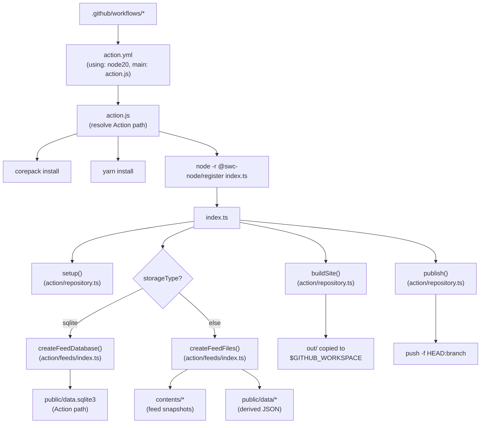

---

## 2) Repository Operations (setup, build, publish)

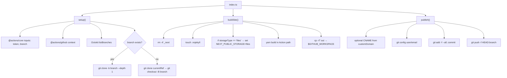

---

## 3) SQLite Database Pipeline

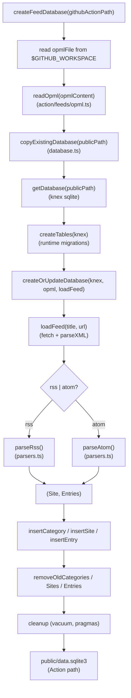

---

## 4) Files/JSON Pipeline

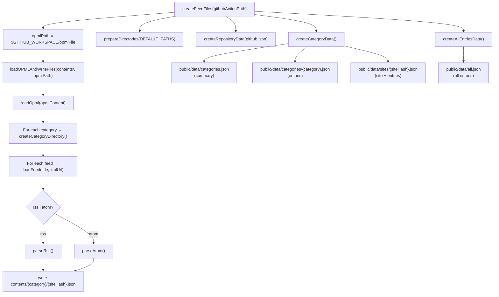

---

## 5) Frontend Runtime Data Access (Next.js)

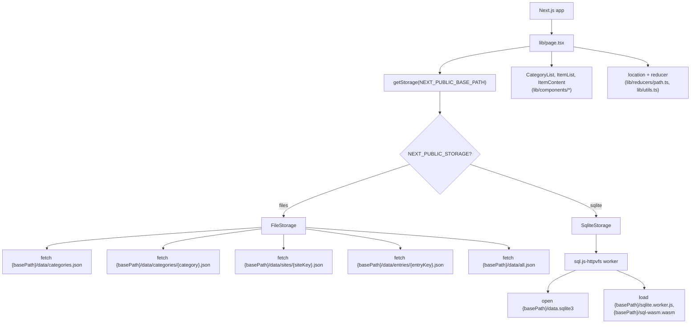

---

## 6) Data Model Overview (SQLite)

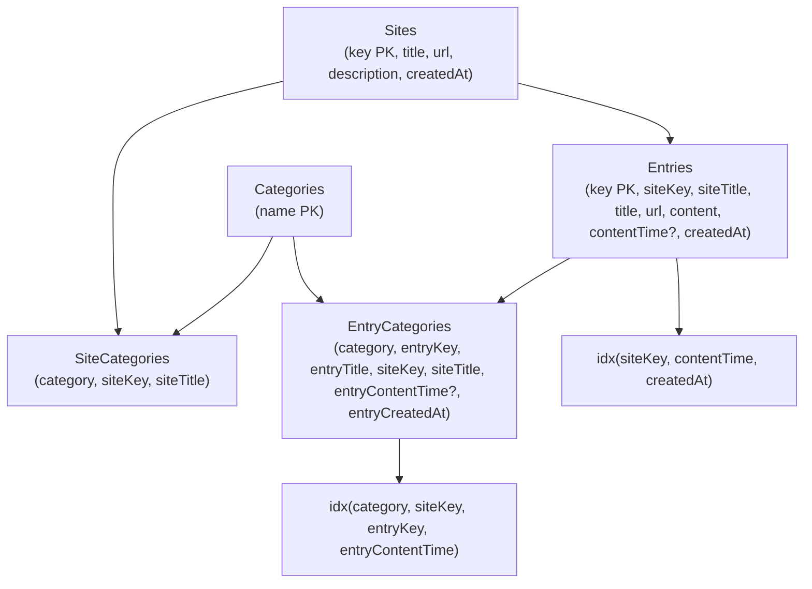

JSON artifacts correspondence:

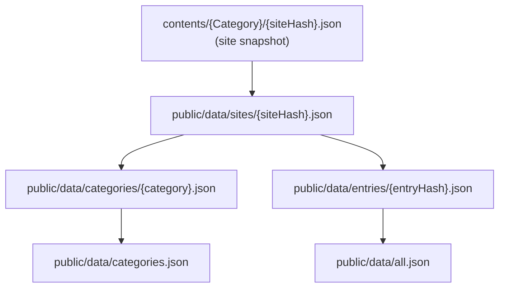

---

## 7) Per-directory Cartography (files and intersections)

action/ and root:

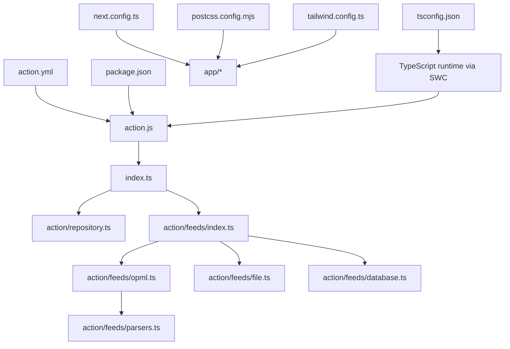

app/ and lib/:

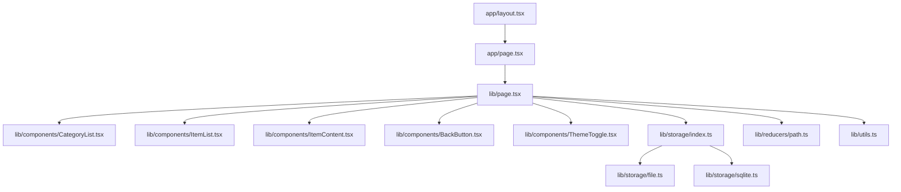

lib/storage/ runtime assets:

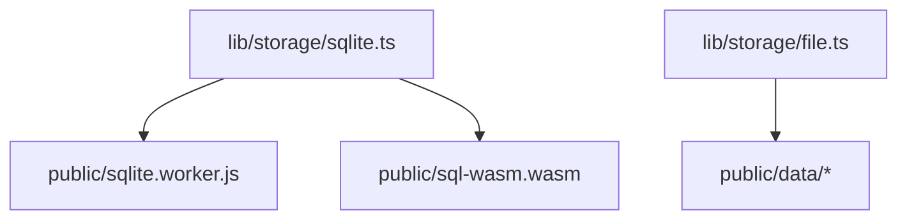

example/:

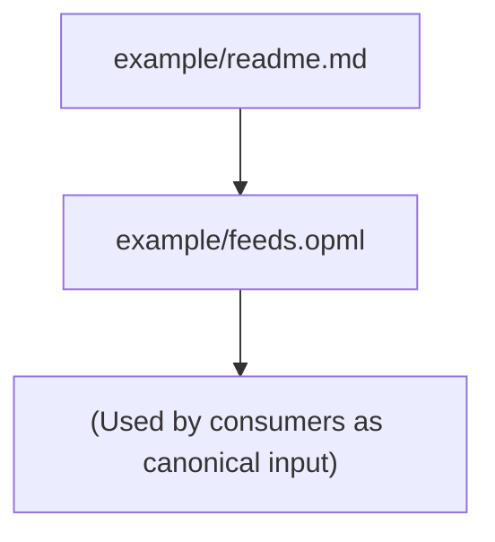

public/:

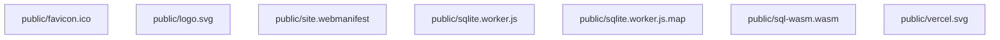

tests and fixtures:

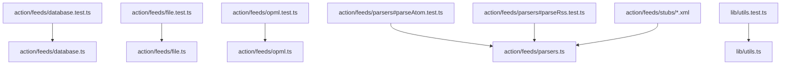

---

## 8) Intersection Flowcharts (process specifics)

index.ts orchestration:

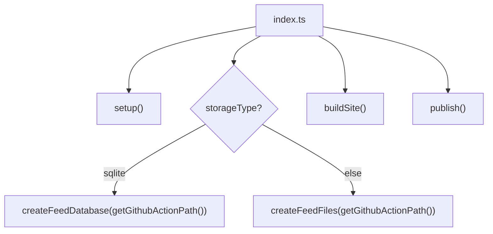

feeds/index.ts dispatch:

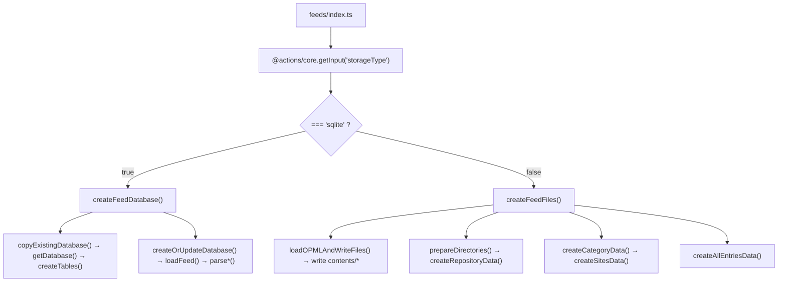

publish cleanup list (files removed prior to publish):

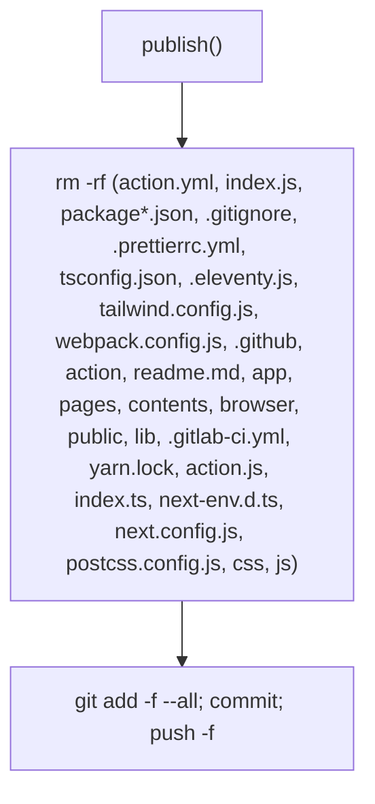

---

## 9) Canonical Workflow (illustrative)

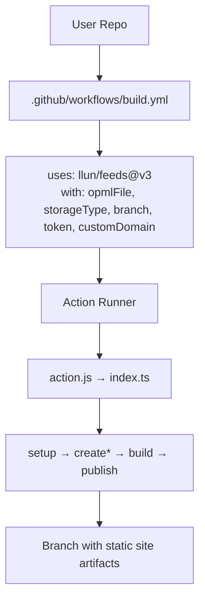

---

## 10) File Inventory Covered (nodes appear in graphs above)

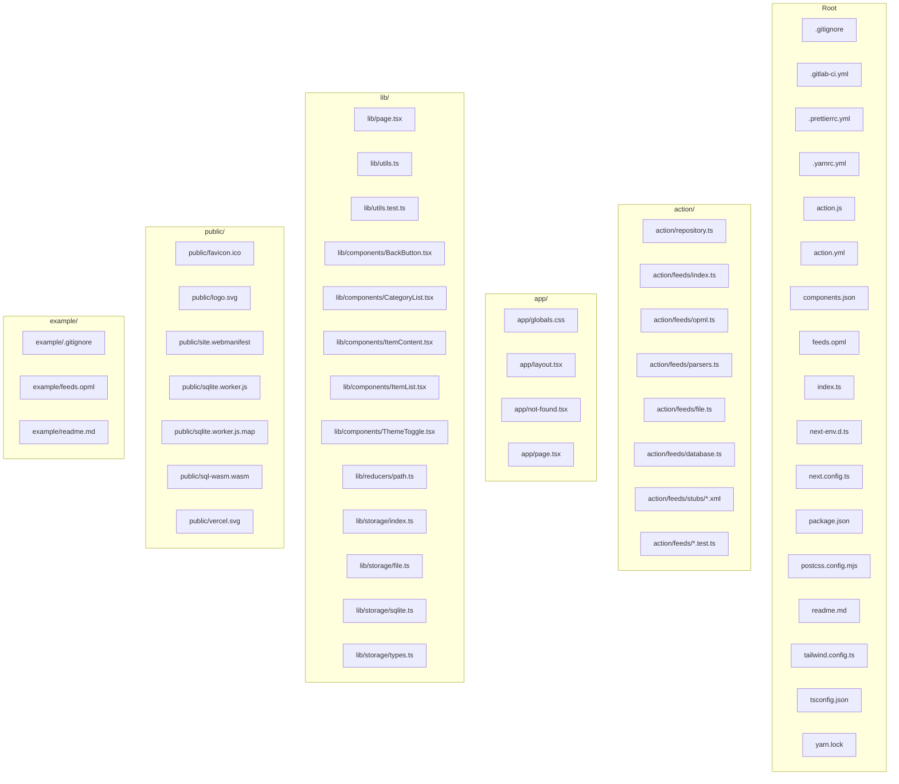

This concludes the comprehensive data-flow and intersection cartography.
