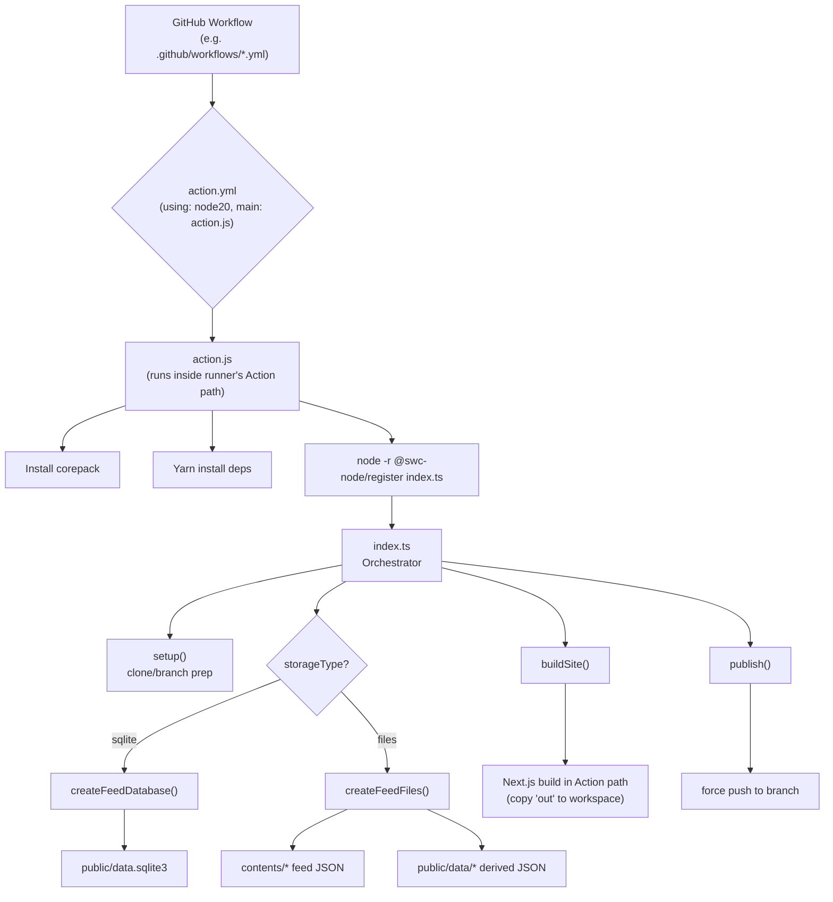
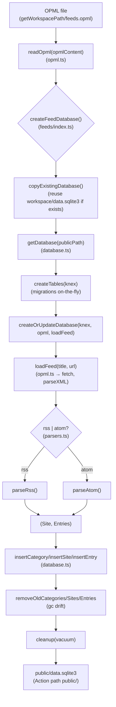
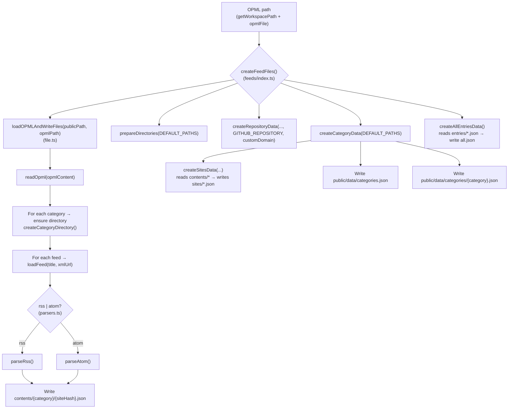
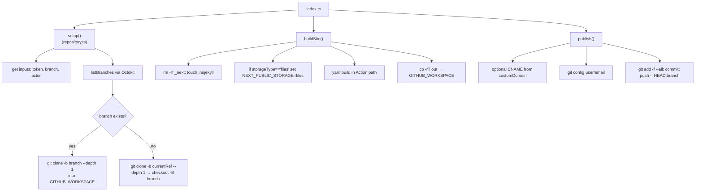
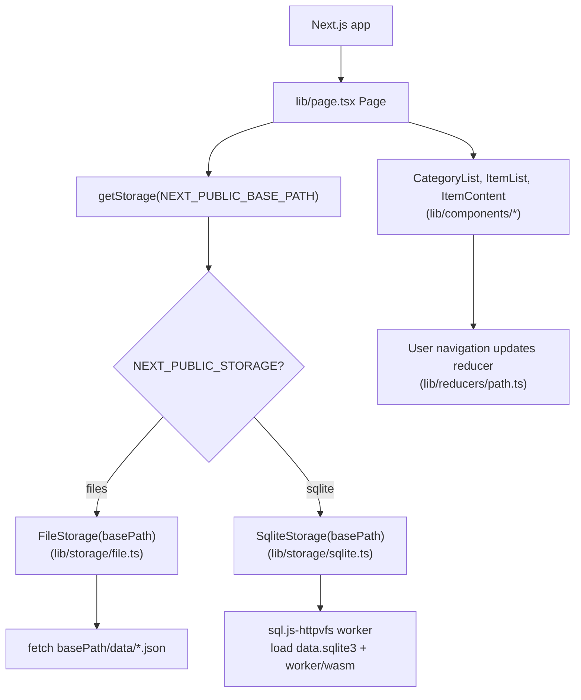
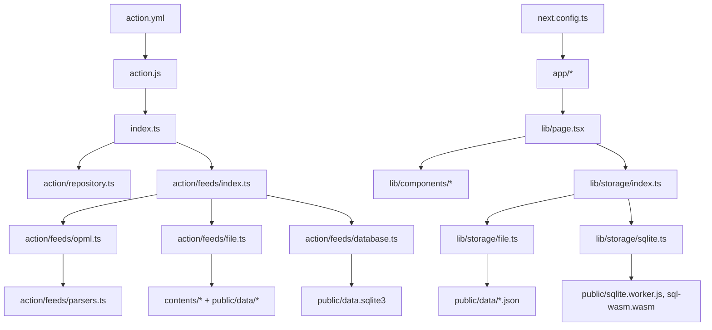
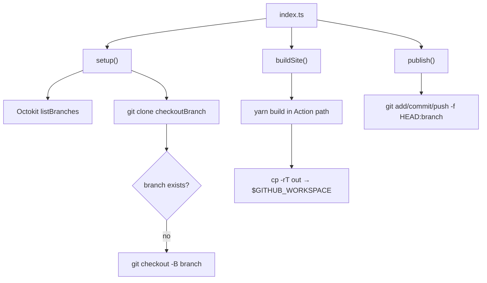
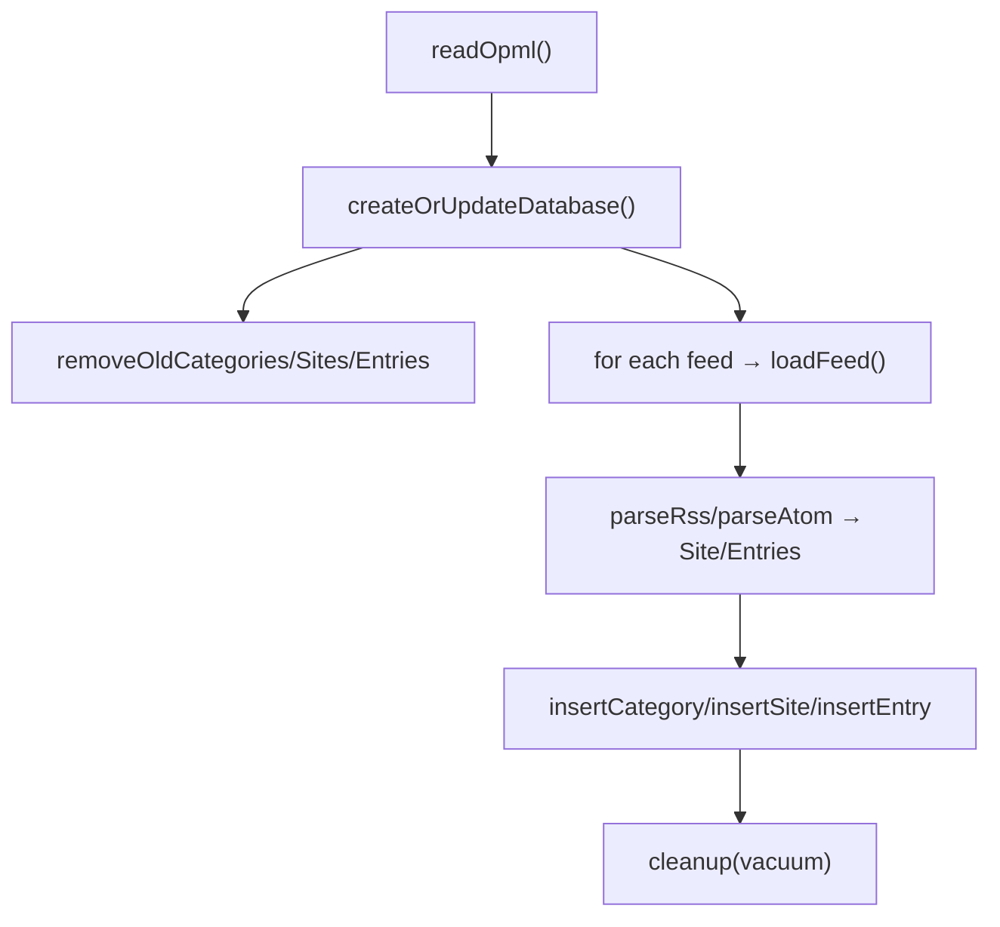
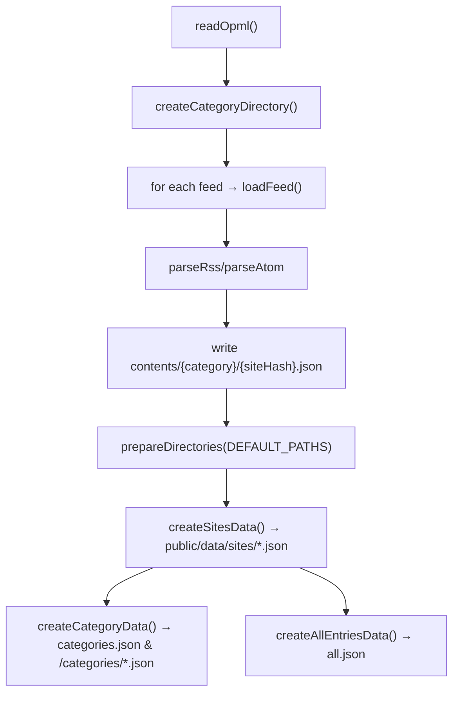
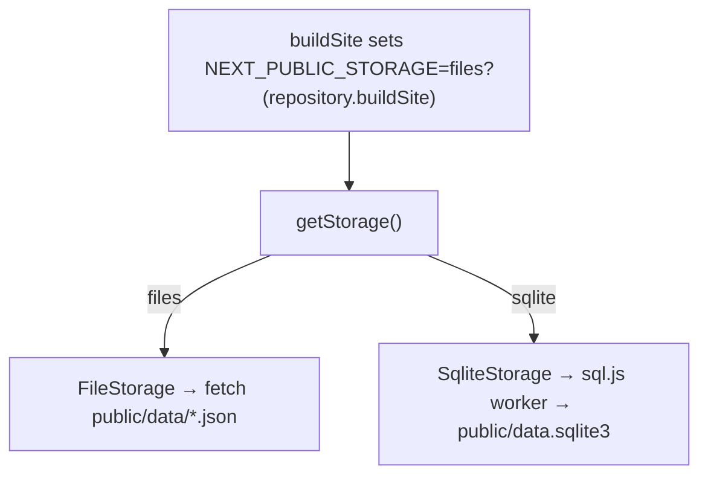

# Cartography Report: FeedsFetcher (Comprehensive, Backend-Focused with GitHub Actions)

This report replaces the previous cartography and provides a comprehensive, backend-focused mapping of how this repository behaves when run as a GitHub Action. It also enumerates all files and draws intersection flowcharts (Mermaid) wherever workflows cross module boundaries. The example folder is treated as the canonical usage source.

Contents:
- 1. Executive Summary
- 2. GitHub Action Lifecycle (end-to-end)
- 3. Inputs, Environment, and Artifacts
- 4. Backend Pipelines
  - 4.1 SQLite database pipeline
  - 4.2 Files/JSON pipeline
- 5. Site Build and Publish (repository operations)
- 6. Next.js Runtime Data Access
- 7. Database Model and Data Artifacts
- 8. Canonical Example Usage
- 9. Error Surfaces and Defensive Behavior
- 10. Per-file Cartography and Directory Graphs (all files)
- Appendix: Large dependency overview graphs (per directory)

---

## 1. Executive Summary

FeedsFetcher aggregates feeds defined in an OPML file into either:
- a client-consumable SQLite database (public/data.sqlite3 + web worker), or
- static JSON datasets under public/data and feed snapshots under contents/.

It runs as a composite Node20 GitHub Action that, when invoked in a GitHub Actions workflow:
1) boots via action.js inside the hosted runner’s Action path,  
2) installs dependencies and executes index.ts with SWC runtime register,  
3) clones your repository’s workspace, checks out/pivots branches,  
4) reads the OPML and pulls/parses feeds, materializes data (SQLite or JSON),  
5) builds a Next.js static site in the Action’s working dir, then copies artifacts to the workspace,  
6) publishes the workspace to the configured branch (force-pushed).

Top-level runtime toggles are controlled by inputs in action.yml (opmlFile, storageType, branch, token, customDomain).

---

## 2. GitHub Action Lifecycle (end-to-end)



Key intersections:
- action.js bootstraps Node and SWC to run TypeScript without transpilation.
- index.ts calls repository.ts functions (setup/buildSite/publish) and feeds/index.ts functions (createFeedDatabase/createFeedFiles).
- feeds/index.ts dispatches into database.ts or file.ts paths and uses opml.ts and parsers.ts.

---

## 3. Inputs, Environment, and Artifacts

From action.yml:
- opmlFile: OPML file path in repo (default feeds.opml)
- storageType: "database" or "files" (action/feeds/index.ts maps "sqlite" vs else; see note)
- branch: output branch for published static site (default contents)
- token: GitHub token for repo cloning/push (default ${{ github.token }})
- customDomain: custom CNAME content (optional)

Runtime environment:
- GITHUB_WORKSPACE: workspace target for clone/build copy/publish
- GITHUB_ACTION: used in action.js to guard execution
- Action Path detection: /home/runner/work/_actions/llun/feeds/(version|main)

Artifacts:
- When storageType == sqlite: public/data.sqlite3 (in Action path), sql worker files public/sqlite.worker.js, public/sql-wasm.wasm
- When storageType != sqlite: contents/{Category}/{site-hash}.json plus public/data/categories.json, public/data/categories/*.json, public/data/sites/*.json, public/data/entries/*.json, public/data/all.json
- Built site: copied from Action’s out/ to workspace root
- Publish: force push HEAD to configured branch on origin

---

## 4. Backend Pipelines

### 4.1 SQLite database pipeline



Notes:
- publicPath is computed from index.ts’s getGithubActionPath() for Action-local public directory.
- copyExistingDatabase allows incremental updates if a prior data.sqlite3 exists in the workspace root.

### 4.2 Files/JSON pipeline



DEFAULT_PATHS uses getGithubActionPath() to place files under the Action path (public/data and contents). The Next.js build step will copy final out/ to the workspace; publish subsequently pushes the workspace.

---

## 5. Site Build and Publish (repository operations)



Sensitive operations:
- Cloning with embedded token in URL
- Force push publishes static artifacts branch

---

## 6. Next.js Runtime Data Access



- When buildSite runs with storageType==files, it sets NEXT_PUBLIC_STORAGE=files so the frontend uses JSON datasets. Without that, default in getStorage() falls to FileStorage unless explicitly set to ‘sqlite’ in env. To serve SQLite, the deployment must set NEXT_PUBLIC_STORAGE=sqlite and ensure public/sqlite.worker.js and sql-wasm.wasm are served with data.sqlite3.

---

## 7. Database Model and Data Artifacts

Relational entities (database.ts creates tables dynamically):
- SchemaVersions (versioning)
- Categories (name primary key)
- Sites (key=sha256(title), title, url, description, createdAt)
- SiteCategories (category, siteKey, siteTitle) with FKs and indices
- Entries (key=sha256(title+link), siteKey, siteTitle, title, url, content, contentTime?, createdAt) with composite index
- EntryCategories (category, entryKey, entryTitle, siteKey, siteTitle, entryContentTime?, entryCreatedAt) with indices and FKs

Files/JSON artifacts:
- contents/{Category}/{siteHash}.json snapshots of source feeds
- public/data/github.json repository metadata (createRepositoryData)
- public/data/categories.json (summary of categories)
- public/data/categories/{category}.json (category entries list)
- public/data/sites/{siteHash}.json (site detail + entries)
- public/data/entries/{entryHash}.json (entry detail)
- public/data/all.json (flat all entries list, sorted desc by date)

---

## 8. Canonical Example Usage

The example/ folder is an empty repo with a populated example/feeds.opml. In a consumer repository:
- Place feeds.opml at repo root or point opmlFile to location.
- Configure workflow to run this Action; choose storageType:
  - database/sqlite pipeline produces a single data.sqlite3 for the client
  - files pipeline produces contents/* + public/data/* JSON.

Minimal workflow concept (illustrative):
```yaml
name: Build Feeds
on:
  push:
  schedule:
    - cron: "0 * * * *"
jobs:
  build:
    runs-on: ubuntu-latest
    steps:
      - name: FeedsFetcher
        uses: llun/feeds@v3
        with:
          opmlFile: feeds.opml
          storageType: database   # or files
          branch: contents
          token: ${{ secrets.GITHUB_TOKEN }}
          customDomain: ''
```

---

## 9. Error Surfaces and Defensive Behavior

- action.js: throws on corepack install failure, yarn install failure, or index.ts launch failure.
- repository.setup(): throws on failed git clone or branch switch.
- repository.buildSite(): throws on Next.js build failure; always copies out to workspace after build attempt.
- feeds/opml.ts.loadFeed(): catches network/XML errors and returns null; logs feed failure but continues pipeline.
- database.ts: defensive checks when inserting, transactional site/category linkage, vacuum and pragmas in cleanup.
- file.ts: stat/mkdir recursion for directories; continues on per-feed errors; JSON write boundaries per site.

Operational considerations:
- Force push overwrites target branch.
- copyExistingDatabase uses COPYFILE_EXCL to not overwrite target if already present; logs and continues on errors.

---

## 10. Per-file Cartography and Directory Graphs (all files)

The following table enumerates every file in the repository and its role. Where a file is part of a workflow intersecting other files, we add a process note.

- .gitignore — workspace hygiene, ensures public artifacts don’t pollute repo during action run.
- .gitlab-ci.yml — alternate CI; not used by GitHub Action runtime.
- .prettierrc.yml — formatting.
- .yarnrc.yml — Yarn v4 config for action runtime.
- action.js — Node bootstrap inside runner Action path; installs deps; launches index.ts with SWC.
- action.yml — Action metadata and inputs; using node20; main is action.js.
- components.json — Shadcn configuration (Used by UI build).
- feeds.opml — Repo-local OPML source (used when running locally via scripts).
- index.ts — Orchestrator: setup -> createFeedDatabase/createFeedFiles -> buildSite -> publish.
- next-env.d.ts — Next.js types.
- next.config.ts — Next.js config.
- package.json — Scripts, dependencies (SWC, Actions libs, Next.js), Yarn resolution.
- postcss.config.mjs — Tailwind/PostCSS.
- readme.md — Project readme.
- tailwind.config.ts — Tailwind.
- tsconfig.json — TypeScript config.
- yarn.lock — lockfile for Yarn.

Directory: action/
- action/repository.ts — Git operations, Action path detection, workspace path, build & publish.
- action/repository.ts intersects with:
  - index.ts (caller)
  - GitHub runner environment (GITHUB_WORKSPACE, GITHUB_ACTION, GITHUB_REPOSITORY)
  - Octokit and @actions/core/github
  - Next.js build step (yarn build) and copying build artifacts to workspace

Directory: action/feeds/
- action/feeds/index.ts — Dispatches storage mode:
  - createFeedDatabase(path) for sqlite
  - createFeedFiles(path) for files/JSON
  - Intersections: @actions/core, getWorkspacePath(), file.ts, database.ts, opml.ts
- action/feeds/opml.ts — loadFeed() (fetch, parseXML, parseAtom/parseRss), readOpml().
  - Intersections: parsers.ts
- action/feeds/parsers.ts — XML parsing, sanitization, normalization to Site/Entry.
- action/feeds/database.ts — Knex/SQLite schema and write/read helpers; GC of categories/sites/entries; incremental copy-in from workspace DB.
- action/feeds/file.ts — Writes contents/* per site snapshot and derives public/data/* datasets for UI.

Directory: app/
- app/globals.css — Global CSS.
- app/layout.tsx — Next.js RootLayout.
- app/not-found.tsx — 404 page.
- app/page.tsx — Next.js entry, likely wraps lib/page.tsx or composes with lib components.

Directory: cartography/
- cartography/report.md — This file.
- cartography/data-flow.md — Flowcharts (expanded in companion doc).

Directory: example/
- example/.gitignore — example repo hygiene.
- example/feeds.opml — Canonical OPML for demonstration.
- example/readme.md — Canonical usage note.

Directory: lib/
- lib/page.tsx — Client Page component orchestrating UI: fetches categories, renders lists/content, uses reducer.
- lib/utils.ts + lib/utils.test.ts — Utilities for routing state and UI classnames.
- lib/components/*.tsx — UI components:
  - BackButton.tsx
  - CategoryList.tsx
  - ItemContent.tsx
  - ItemList.tsx
  - ThemeToggle.tsx
- lib/reducers/path.ts — Reducer for path/location state.
- lib/storage/types.ts — Types for Storage interface (Category, Content, SiteEntry).
- lib/storage/index.ts — getStorage() switch on NEXT_PUBLIC_STORAGE to `files` or `sqlite`.
- lib/storage/file.ts — Fetch JSON assets under basePath/data/*.json.
- lib/storage/sqlite.ts — Load SQL DB with sql.js-httpvfs worker and query via SQL.
- lib/fixtures/ — Any fixtures (not currently listed with files here).

Directory: public/
- public/favicon.ico, logo.svg, vercel.svg — assets.
- public/site.webmanifest — PWA metadata.
- public/sqlite.worker.js, public/sqlite.worker.js.map — sql.js-httpvfs worker script.
- public/sql-wasm.wasm — sql.js runtime wasm.

Process intersections worth flowcharting:
- index.ts ↔ repository.ts (setup/build/publish)
- index.ts ↔ feeds/index.ts (storage path)
- feeds/index.ts ↔ opml.ts + parsers.ts (feed loading/parsing)
- feeds/index.ts ↔ database.ts (SQLite pipeline)
- feeds/index.ts ↔ file.ts (Files/JSON pipeline)
- buildSite (sets env for UI) ↔ lib/storage/* (runtime selection of storage)
- publish ↔ workspace (copy out/ then push to branch)

---

## Appendix A: Dependency Overview Graphs

High-level modules:



Repository operations only:



SQLite pipeline only:



Files pipeline only:



Frontend runtime selection:



---

This report pairs with the expanded flowcharts in cartography/data-flow.md for visual deep dives. It accounts for every file in the repo and highlights all major workflow intersections relevant to GitHub Actions execution.
